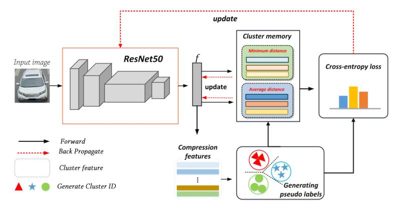
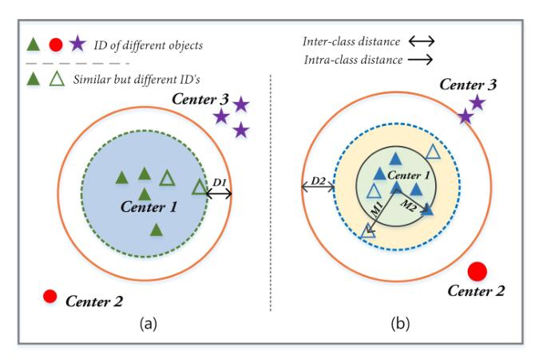
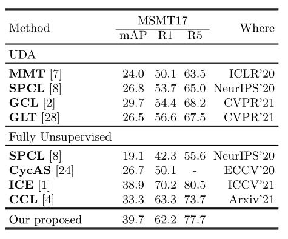

# Exploiting Robust Memory Features for Unsupervised Reidentification

"2022/05/10" the conference paper code.

## Model

- Our architecture consists of three modules: the backbone feature module, the cluster generation pseudo-labeling module, and cluster memory module.

<p align="center" >
    

- Innovation of Our Method.
    
<p align="center" >
    

## Train
    
- The batchsize of 64 is the single-GPU training, and the 256 size for multi-GPU training.
    
```shell
CUDA_VISIBLE_DEVICES=0 python usl.py -b 64 -a resnet50 -d veri --iters 400 --momentum 0.1 --eps 0.7 --num-instances 16 --height 224 --width 224 --use-hard 
CUDA_VISIBLE_DEVICES=0 python usl.py -b 64 -a resnet50 -d msmt17 --iters 400 --momentum 0.1 --eps 0.7 --num-instances 16 --use-hard 
    
CUDA_VISIBLE_DEVICES=0,1,2,3 python usl.py -b 256 -a resnet50 -d veri --iters 400 --momentum 0.1 --eps 0.7 --num-instances 16 --height 224 --width 224 --use-hard 
CUDA_VISIBLE_DEVICES=0,1,2,3 python usl.py -b 256 -a resnet50 -d msmt17 --iters 400 --momentum 0.1 --eps 0.7 --num-instances 16 --use-hard 
```

## Results

- ResNet50 was used as our backbone network and the imagenet pre-trained model was loaded.
- VeRi776.
<p align="center">
    

- MSMT17.
<p align="center">
    
    
## Acknowledgements
---
    
Acknowledgement to the following open source projects, we have listed them.
    
- [deepcluster](https://github.com/facebookresearch/deepcluster)
- [cluster-contrast-reid](https://github.com/alibaba/cluster-contrast-reid)
